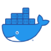

# React Django Boilerplate

    

    

## Table of Contents
1. [Description](#description)
1. [Tech Stack and Packages Installed](#tech_stack)
1. [Install (Run) with Docker](#docker)
1. [Install without Docker](#install)
1. [Django Files and Folders of interest](#django)
1. [About Nginx Configuration](#nginx)
1. [Useful Links](#useful_links)